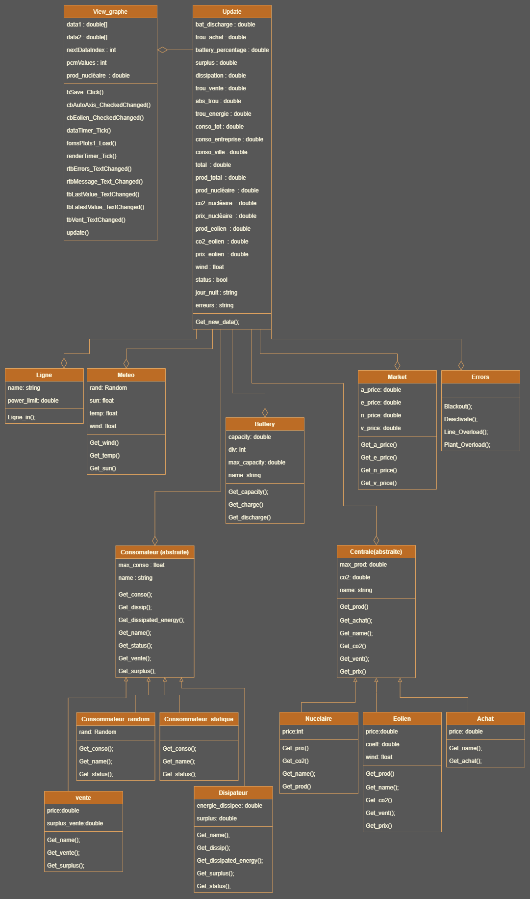

# Projet POO 20325 20194

Ce projet est une plateforme développée en C# destinée à des chercheurs qui désirent simuler un réseau électrique à l’échelle désirée.
Ce dernier possède une plateforme facile à modifier. 
Il est possible d’ajouter des sources productrices d’énergie, créer de nouveaux types de producteurs énergétiques, ajouter autant de consommateurs que l’on désire, créer de nouveaux types de consommateurs.  
Un système de météo est présent qui permet de simuler 3 paramètres : la force du vent, l’ensoleillement ainsi que la température. 
Un système de marché permet de gérer les prix unitaires pour plusieurs types d’énergies ainsi que le prix auquel l’électricité est achetée depuis l’étrangers.

## Production

Lors du développement de ce projet, nous avons décidé de créer trois types de producteurs d’énergie sans pour autant limiter ce nombre à l’avenir (nucléaire, éolien, achat à l’étrangers).
Pour créer une centrale d’un type connu, il faut ajouter du code dans la classe Update :
Il faut commencer par déclarer le nom de la centrale (x1) au-dessus du constructeur public *update()* :
```csharp
Centrale x1 ;
```
Il faut également ajouter une variable pour stocker la valeur de production :
```csharp
double Xo1;
```
Ensuite, il faut créer une instance au sein du constructeur public *Update()* :
```csharp
x1 = new Eolien(2000, 1, "x1", market, bruxelles);
```
x1 est le nom utilisé dans le code lors d’appel de méthodes, ou bien quand on doit récupérer ses attributs. Eolien est le type de centrale crée (il existe pour le moment Nucléaire, Eolien, et Achat) au sein des parenthèses, il faut mettre dans le bon ordre les paramètres de la centrale. On commence par la production maximale théorique exprimée en W, ensuite la quantité de CO2 produite par W. Market est le nom de la plateforme qui gère les prix de production et d’achat dans notre programme (objet de type Market) et dans le cas de l’éolien, nous avons également en paramètre la plateforme de météo (bruxelles) pour pourvoir récupérer la force du vent et ainsi produire de l’énergie en fonction de ce dernier.

À présent, nous pouvons assigner la centrale à une ligne électrique. Si vous souhaitez raccorder la centrale à une ligne existante, il suffit d’ajouter le bloc suivant dans la partie 
« ASIGNATION DES LIGNES & GESTION ERREURS SURCHARGES COTE PRODUCTION »
Dans le cas de l’éolien nous pouvons choisir de désactiver sa production en pleine simulation avec cette condition que nous détaillerons plus tard.


## Diagrame de classe 



## Creation d’une nouvelle classe pour une centrale 

Dans le cas de la création d’une nouvelle Eolienne 
Premièrement il faut savoir que toutes les centrales sont reliées à la classe Centrale. Donc pour connaitre les différentes méthodes déjà utilisables il suffit de parcourir la classe Centrale, et dans le cas ou aucune méthode ne convient il faudra d’abord la crée dans la Classe centrale.  
Toutes les centrales ont une déclaration de base qui est similaire.
```csharp
public class Nom_centrale : Centrale  //classe pour créer/gérer une source d'énergie 
{
   public double price;
   public Nom_centrale (double max_prod, double co2, string name, Market market) : base(max_prod, co2, name)
   {
      this.price = market.Get_n_price();  //récupération du prix KWh du marché
   }
   public override double Get_prod() // production
   {
      return max_prod;
   }
   public override double Get_prix() // prix pour produire l'énergie nucléaire
   {
      return price * this.Get_prod();
   }
   public override double Get_co2() // CO2
   {
      return base.Get_co2();
   }
   public override string Get_name()
   {
      return base.Get_name();
   }
}
```
Dans le cas d’une centrale nucléaire il n’y a pas besoin de plus, cependant si cette centrale est influencée par la météo, par exemple, il faudra rajouter des méthodes. 
1.	Le cas où la méthode existe déjà. 
Si la méthode est déjà présente dans la classe centrale il suffit simplement de la rajouter dans la nouvelle classe et de rajouter les paramètres qui y sont lier. 
Par exemple pour avoir une valeur de vent il faut rajouter la méthode Get_vent() pour cela il faut rajouter plusieurs chose. 
Une variable globale à la classe.
```csharp
Float wind = 0 ;
```
Ensuite dans la déclaration de la classe il faut rajouter l’appel de la classe Meteo car c’est a cette endroit la que l’on récupèrera notre variable de vent.  Puis il faut ajouter le methode Get_wind() de Meteo et l’assigner a notre variable globale crée plus tôt. Cela nous donne.
```csharp
public Nom_centrale (double max_prod, int co2, string name, Market market , Meteo meteo) : base(max_prod, co2, name)
{
   this.wind = meteo.Get_wind();   //récupération de la vitesse du vent depuis la classe météo
   this.price = market.Get_e_price();  //récupération du prix KWh du marché
}
```
Ensuite il nous suffit simplement de rajouter la methode Get_vent().
```csharp
public override float Get_vent(Meteo meteo)
{
   wind = meteo.Get_wind();
   return wind;
}
```

